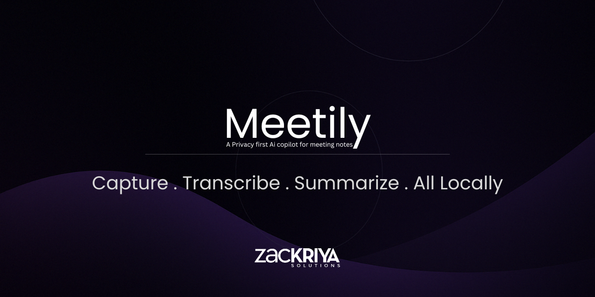

    <h1>
        
         
        Maity Copiloto - Asistente de Reuniones con IA
    </h1>
     
    
    
    
     
    <h3>
     
    Transcripcion Local con IA - Resumenes Inteligentes - Privacidad Total
    </h3>

---

## Que es Maity Copiloto?

Maity Copiloto es un asistente de reuniones con inteligencia artificial enfocado en **privacidad**. Graba tus reuniones, las transcribe **localmente en tu computadora** usando modelos de IA (Parakeet/Canary) y genera resumenes inteligentes con proveedores de LLM de tu eleccion.

**Tu audio nunca sale de tu computadora.** Toda la transcripcion se procesa localmente sin enviar datos a la nube. No necesitas internet para transcribir tus reuniones.

Construido con Tauri 2.x (Rust) + Next.js 14 + React 18 para un rendimiento nativo y una experiencia de usuario moderna.

---

## Caracteristicas Principales

- **Transcripcion 100% Local:** Transcribe reuniones con Parakeet (por defecto) o Canary (mejor precision en espanol), sin necesidad de internet.
- **Grabacion Stereo Dual-Canal:** Captura audio del microfono (canal izquierdo) y del sistema (canal derecho) simultaneamente, permitiendo separacion de hablantes.
- **Resumenes con IA:** Genera resumenes automaticos con Ollama (local y gratuito), Claude (Anthropic), Groq o OpenRouter.
- **Deteccion Automatica de Reuniones:** Detecta automaticamente cuando inicias Zoom, Teams, Meet, Webex, Discord, Slack, etc.
- **Modo Oscuro:** Interfaz completamente adaptada para trabajar de noche.
- **Privacidad Total:** Todo el procesamiento de audio y transcripcion ocurre localmente en tu computadora. Ningun audio se envia a la nube.

---

## Instalacion

### Windows

1. Descarga el instalador desde [Releases](https://github.com/ponchovillalobos/maity-desktop/releases/latest)
   - `Maity_0.2.1_x64-setup.exe` (Recomendado)
   - `Maity_0.2.1_x64_en-US.msi` (Para empresas/IT)

2. Ejecuta el instalador
   - Si Windows muestra advertencia de seguridad: Clic en **Mas informacion** > **Ejecutar de todas formas**

3. Abre **Maity** desde el menu de inicio

4. En la primera ejecucion, el modelo de transcripcion Parakeet (~670 MB) se descargara automaticamente. Solo necesitas esperar una vez.

### Requisitos del Sistema

| Requisito | Minimo | Recomendado |
|-----------|--------|-------------|
| **Sistema Operativo** | Windows 10 (64-bit) | Windows 11 (64-bit) |
| **RAM** | 4 GB | 8 GB o mas |
| **Almacenamiento** | 2 GB libres | 4 GB libres |
| **Microfono** | Cualquiera | Auriculares con microfono |
| **Internet** | No requerido para transcripcion | Solo para resumenes con LLM en nube |

> **Nota:** No necesitas internet para la transcripcion. Los modelos se descargan una sola vez en la primera ejecucion y luego funcionan completamente offline.

---

## Como Funciona

### 1. Grabacion de Audio

Captura audio del microfono y del sistema simultaneamente en formato stereo dual-canal. Perfecto para grabar llamadas de Zoom, Teams, Meet y cualquier aplicacion con audio.

    

### 2. Transcripcion en Tiempo Real

Transcribe tus reuniones **localmente** usando los motores de transcripcion **Parakeet** (por defecto) o **Canary** (opcional, mejor precision en espanol). La transcripcion aparece en tiempo real mientras hablas, con identificacion automatica de hablantes.

    

### 3. Resumenes con IA

Genera resumenes automaticos con el proveedor de IA de tu eleccion: **Ollama** (local y gratuito), **Claude** (Anthropic), **Groq** o **OpenRouter**. Obten puntos clave, decisiones tomadas y acciones pendientes de forma automatica.

    

### 4. Configuracion

Personaliza la aplicacion segun tus necesidades: motor de transcripcion, proveedor de IA para resumenes, idioma, dispositivos de audio y mas.

    

---

## Motores de Transcripcion

Ambos motores funcionan **100% localmente** en tu computadora, sin enviar audio a ningun servidor externo.

| Motor | Tipo | Tamano | Precision | Mejor Para |
|-------|------|--------|-----------|------------|
| **Parakeet** (por defecto) | Local ONNX | 670 MB | Buena | Uso general, rapido |
| **Canary** (opcional) | Local ONNX | 939 MB | Alta | Mejor precision en espanol |

- **Parakeet** (`parakeet-tdt-0.6b-v3-int8`): Motor por defecto. Se descarga automaticamente en la primera ejecucion. Arquitectura transducer (TDT) optimizada para velocidad.
- **Canary** (`canary-1b-flash-int8`): Motor opcional con arquitectura encoder-decoder. Ofrece mejor precision especialmente en espanol. Se descarga desde la configuracion de la aplicacion.

---

## Proveedores de IA para Resumenes

| Proveedor | Tipo | Costo | Descripcion |
|-----------|------|-------|-------------|
| **Ollama** | Local | Gratis | Modelos locales (Llama, Mistral, etc.), sin internet requerido |
| **Claude** | Nube | Pago por uso | API de Anthropic, alta calidad de resumenes |
| **Groq** | Nube | Plan gratuito | Rapido, plan gratuito disponible con limites |
| **OpenRouter** | Nube | Pago por uso | Acceso a multiples modelos de diferentes proveedores |

> **Tip:** Si quieres una experiencia completamente offline y gratuita, usa **Ollama** como proveedor de resumenes junto con la transcripcion local. No necesitaras internet para nada.

---

## Preguntas Frecuentes

### Necesito internet para usar Maity?

**No para la transcripcion.** Toda la transcripcion se realiza localmente en tu computadora. Solo necesitas internet si eliges un proveedor de resumenes en la nube (Claude, Groq u OpenRouter). Si usas Ollama para resumenes, tampoco necesitas internet.

### Donde se procesan mis datos?

**Todo localmente.** El audio se procesa en tu computadora con modelos de IA que se ejecutan localmente (Parakeet o Canary). Las transcripciones se almacenan en una base de datos local. El unico dato que podria salir de tu computadora es el texto de la transcripcion si eliges un proveedor de resumenes en la nube.

### Cuanto cuesta?

La aplicacion es **completamente gratuita**. Los modelos de transcripcion locales tambien son gratuitos. El unico costo posible es si decides usar un proveedor de resumenes en la nube:
- **Ollama:** Gratuito (local)
- **Groq:** Plan gratuito disponible con limites
- **Claude:** Pago por uso (API de Anthropic)
- **OpenRouter:** Pago por uso

### Que reuniones puedo grabar?

Cualquier reunion donde puedas escuchar el audio: Zoom, Google Meet, Microsoft Teams, Webex, Discord, Slack, llamadas telefonicas, y cualquier otra aplicacion con audio.

### Es legal grabar reuniones?

Depende de tu jurisdiccion. En muchos lugares debes informar a los participantes que estas grabando. **Maity te recuerda esto antes de cada grabacion.**

### Que tan buena es la transcripcion local?

La transcripcion local con Parakeet y Canary ofrece una precision competitiva. Canary destaca especialmente en espanol. La calidad depende de la claridad del audio, el microfono utilizado y el ruido ambiente.

---

## Soporte

Si encuentras algun problema o tienes sugerencias:

1. Abre un [Issue en GitHub](https://github.com/ponchovillalobos/maity-desktop/issues)
2. Incluye la version de Maity y tu sistema operativo
3. Describe el problema con el mayor detalle posible

---

## Licencia

[MIT License](LICENSE) - Puedes usar, modificar y distribuir este proyecto libremente.

---

## Creditos

Este proyecto utiliza:
- [Tauri](https://tauri.app/) - Framework de aplicaciones de escritorio (Rust + Web)
- [ONNX Runtime](https://onnxruntime.ai/) - Motor de inferencia para modelos de IA locales
- [Parakeet TDT](https://huggingface.co/nvidia/parakeet-tdt-0.6b) - Modelo de transcripcion de NVIDIA
- [Canary 1B Flash](https://huggingface.co/nvidia/canary-1b-flash) - Modelo de transcripcion multilingue de NVIDIA
- [Next.js](https://nextjs.org/) - Framework React para la interfaz de usuario
- [Ollama](https://ollama.ai/) - Plataforma de modelos de IA locales

---

    

        <b>Maity Desktop v0.2.1</b> 
        Hecho con amor para profesionales que valoran su privacidad
    

