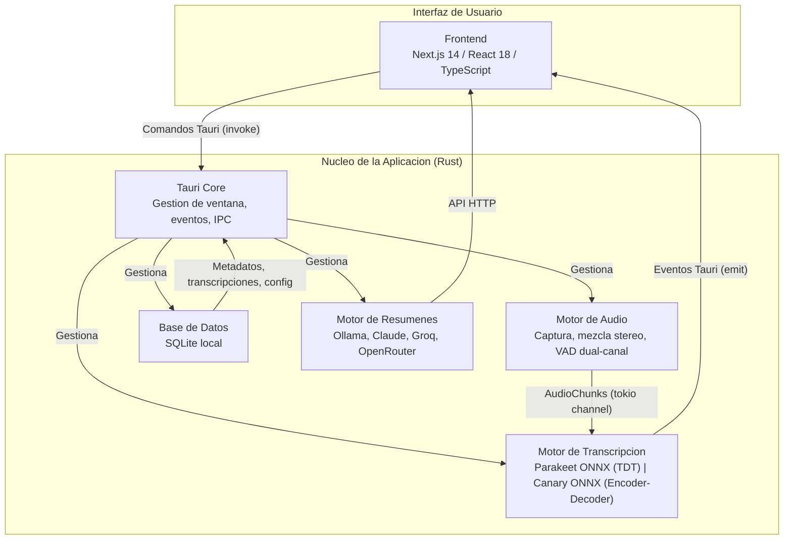

# Arquitectura del Sistema

## Descripcion General

Maity es una aplicacion de escritorio autocontenida construida con [Tauri](https://tauri.app/). Combina un backend basado en Rust con un frontend Next.js en una unica aplicacion eficiente y multiplataforma. Toda la transcripcion se ejecuta localmente usando modelos ONNX (Parakeet y Canary), sin depender de servicios en la nube. Los resumenes de reuniones se generan mediante LLMs configurables (Ollama local, Claude, Groq, OpenRouter).

## Diagrama de Arquitectura de Alto Nivel



## Detalles de Componentes

### Frontend (Next.js)

- **Stack**: Next.js 14 + React 18 + TypeScript
- Proporciona la interfaz de usuario para gestionar reuniones, mostrar transcripciones en tiempo real y configurar la aplicacion.
- Se comunica con el nucleo Rust a traves del sistema de comandos de Tauri (`invoke` para llamadas frontend-a-Rust, `listen` para eventos Rust-a-frontend).
- Componentes principales:
  - `page.tsx` - Interfaz principal de grabacion
  - `SidebarProvider.tsx` - Gestion de estado global (reuniones, grabacion)
  - `TranscriptView.tsx` - Visualizacion de transcripciones en tiempo real
  - `RecordingControls.tsx` - Controles de inicio/parada de grabacion

### Backend Rust

#### Tauri Core

- Punto de entrada principal: `lib.rs`
- Gestiona el ciclo de vida de la ventana, registro de comandos y comunicacion IPC.
- Expone comandos Rust al frontend (e.g., `start_recording`, `stop_recording`, `get_transcript_config`).
- Emite eventos hacia el frontend (e.g., `transcript-update`, `speech-detected`).

#### Motor de Audio

- **Captura de microfono**: Via `cpal` (multiplataforma). Archivo: `capture/microphone.rs`.
- **Captura de audio del sistema**: Via WASAPI (Windows) o CoreAudio/ScreenCaptureKit (macOS). Archivo: `capture/system.rs`.
- **Pipeline de audio** (`pipeline.rs`):
  - Recibe audio crudo de ambas fuentes (microfono y sistema) de forma asincrona.
  - Entrelaza el audio como stereo: canal izquierdo = microfono (usuario), canal derecho = sistema (interlocutor).
  - Aplica VAD (Voice Activity Detection) de forma independiente por canal (`mic_vad_processor`, `sys_vad_processor`).
  - Distribuye chunks de audio a tres rutas paralelas: grabacion (stereo), transcripcion local (mono, solo voz), y guardado incremental.
- **Grabacion**: `recording_manager.rs` orquesta el ciclo completo. `recording_saver.rs` escribe archivos de audio. `incremental_saver.rs` realiza checkpoints cada 30 segundos para prevenir perdida de datos.
- **Codificacion**: `encode.rs` convierte PCM a AAC/MP4 via FFmpeg.

#### Motor de Transcripcion

- **Parakeet** (proveedor por defecto):
  - Arquitectura TDT (Token-and-Duration Transducer) ejecutada via ONNX Runtime.
  - Modelo: `parakeet-tdt-0.6b-v3-int8` (670MB).
  - WER en espanol: 3.45% (CPU).
  - Se inicializa incondicionalmente al arrancar la aplicacion.
- **Canary** (proveedor opcional):
  - Arquitectura encoder-decoder (autoregresivo) ejecutada via ONNX Runtime.
  - Modelo: `canary-1b-flash-int8` (939MB).
  - WER en espanol: 2.69% (MLS benchmark).
  - Se inicializa solo si el usuario lo ha seleccionado en la configuracion (guardada en SQLite).
  - Soporte multiidioma: en, es, de, fr (con tokens de tarea).
- **Whisper**: Codigo presente pero deshabilitado. No se inicializa al arrancar.
- El trait `TranscriptionProvider` define la interfaz unificada para todos los proveedores.
- El `TranscriptionEngine` enum gestiona la seleccion y despacho hacia el proveedor activo.
- Los workers paralelos (`worker.rs`) reciben chunks de audio, los acumulan mediante `ChunkAccumulator` y los envian al motor para transcripcion.

#### Base de Datos

- SQLite local gestionada via la capa de persistencia en Rust.
- Almacena:
  - Metadatos de reuniones (nombre, fecha, duracion).
  - Transcripciones completas con timestamps relativos a la grabacion.
  - Configuracion de transcripcion (proveedor y modelo seleccionado).
  - Configuracion de LLM para resumenes.

#### Motor de Resumenes

- Genera resumenes de reuniones 100% LOCAL utilizando llama-helper sidecar (GGUF runtime).
- Modelos default: qwen3:1.7b para evaluacion + coach, qwen3:0.6b legacy.
- Sin dependencias de nube (Claude/Groq/OpenRouter eliminados de UI principal).
- v21 cleanup: backend Python (`backend/app/main.py:5167`) ELIMINADO. Toda la persistencia
  ahora vive en SQLite local manejado directamente desde Rust (sin servidor HTTP intermedio).

## Pipeline de Audio

El sistema de audio implementa un pipeline dual-canal con tres rutas paralelas:

1. **Ruta de Grabacion**: El audio de microfono y sistema se entrelaza como stereo (L=mic, R=sistema) y se guarda a disco con checkpoints incrementales cada 30 segundos.

2. **Ruta de Transcripcion Local**: Procesadores VAD independientes por canal detectan segmentos de voz. Solo los segmentos con voz activa se envian al motor de transcripcion (Parakeet o Canary), reduciendo la carga de procesamiento en ~70%.

3. **Ruta de Guardado Incremental**: Checkpoints periodicos de 30 segundos que previenen perdida de datos en caso de crash.

El `DeviceType` (Microphone/System) se captura antes de enviar al motor de transcripcion, mapeando `Microphone` a `"user"` y `System` a `"interlocutor"` para identificacion de hablantes.

## Comunicacion Frontend-Backend

### Comandos Tauri (Frontend -> Rust)

El frontend invoca funciones Rust usando el sistema de comandos de Tauri:

```typescript
// Frontend: invocar comando Rust
const result = await invoke('start_recording', {
  mic_device_name: "Built-in Microphone",
  system_device_name: "Speakers (WASAPI Loopback)",
  meeting_name: "Reunion de equipo"
});
```

```rust
// Rust: definicion del comando
#[tauri::command]
async fn start_recording<R: Runtime>(
    app: AppHandle<R>,
    mic_device_name: Option<String>,
    system_device_name: Option<String>,
    meeting_name: Option<String>
) -> Result<(), String> {
    // Delega a audio::recording_commands
}
```

### Eventos Tauri (Rust -> Frontend)

Rust emite eventos hacia el frontend para actualizaciones en tiempo real:

```rust
// Rust: emitir actualizacion de transcripcion
app.emit("transcript-update", TranscriptUpdate {
    text: "Hola, esto es una prueba".to_string(),
    timestamp: "14:30:05".to_string(),
    source: "Audio".to_string(),
    sequence_id: 42,
    // ...
})?;
```

```typescript
// Frontend: escuchar eventos
await listen<TranscriptUpdate>('transcript-update', (event) => {
  setTranscripts(prev => [...prev, event.payload]);
});
```

### Eventos principales emitidos por Rust

| Evento | Descripcion |
|--------|-------------|
| `transcript-update` | Nueva transcripcion (parcial o final) disponible |
| `transcription-error` | Error en el motor de transcripcion |
| `speech-detected` | Primera deteccion de voz en la sesion |
| `transcription-progress` | Progreso del procesamiento de chunks |
| `transcription-summary` | Resumen final al terminar la grabacion |
